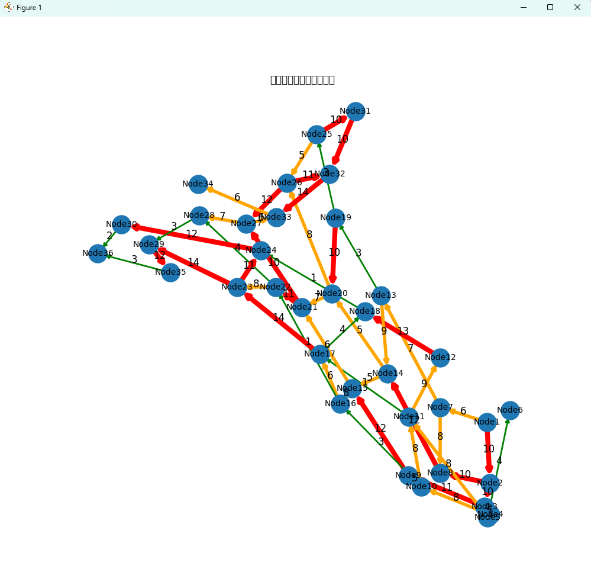
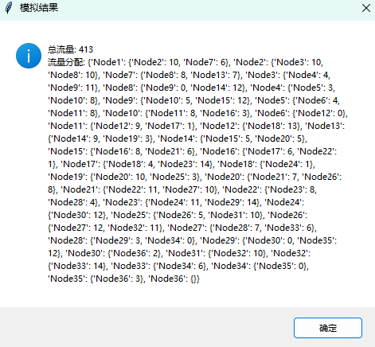

## README

#### 项目情况

用户首先需要生成交通网络。网络由节点（交叉口、终点等）和链接（道路）组成。用户可以通过 import networkx 模块导入现有的网络数据，定义节点和链接的属性，如流量等。之后随机选择终点和起点，然后使用Dijkstra 算法计算最短路径。迭代调整流量，直到收敛，然后计算总流量。最后绘制出结果，流量的多少通过线的粗细以及颜色来表示，流量越大线条越粗。

#### 效果展示

#### 小组分工

| 姓名   | 分工               |
| ------ | ------------------ |
| 潘子昊 | 设计，编码         |
| 陈昱行 | 测试，报告         |
| 毕家宝 | 文档写作，报告整理 |
| 张珈铭 | 调试               |